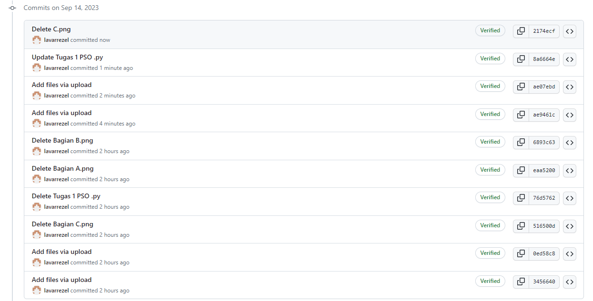

### A. Menampilkan Nama dan NRP di Python

```py
print("Nama: Alfa Naufal Afif Lintang Madani")
print("NRP: 5009211062")
```


### B. Hasil dan Script di Spyder

Python Script: https://github.com/lavarrezel/tugas-sinyal-1/blob/main/Tugas%201%20PSO%20.py


### C. Last Commit Logs



